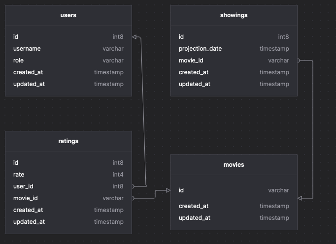

# Fast&Furious Cinema Backend

## How to setup
* Ruby 3, Rails 6, PostgreSQL, Redis
* Create `.env` file (look at `.env.example` - all required settings are listed there)
*
    ```sh
    $ cd ff-cinema
    $ bundle
    $ rake db:create
    $ rake db:migrate
    $ rake db:seed # IDs of the required movies are loaded here
    $ rails s
    ```

## Further improvements & some clarifications
* Create more specs - created only sample specs for most important places in the code
* Update the format of API requests and responses to have `camelCase` instead of `snake_case`
* App authorization is basically just an imitation - in order to be authorized user need to send `Authorization` header where the value is his `user_id`...
* ... unless his an admin - then also his `role` is being checked


## Documentation
API documentation can be access under the `/swagger` URL.
Generated documents with swagger docs can be found under  the following URLs:
* `{host}:{port}/v1_admin_swagger.json` - for admin app
* `{host}:{port}/v1_swagger.json` - for user app

### ERD


